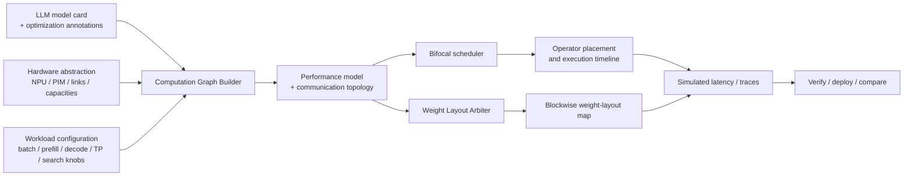

# DOPS: Dynamic OPerator Sorting for Heterogeneous NPU–PIM LLM Inference

DOPS is a simulation and analysis framework for studying decoder-only LLM inference on heterogeneous **NPU–PIM** platforms. It accompanies the paper **Beyond Prefill-Decode Partition: Dissecting LLM Inference for Heterogeneous Platforms via Dynamic OPerator Sorting** and provides a practical codebase for computation-graph construction, hardware abstraction, runtime modeling, scheduling, weight-layout search, trace export, and result analysis.

**Quick links:** [Demo video](https://vimeo.com/1178735972) · [Configuration Reference](./docs/CONFIG_REFERENCE.md)

---

## Overview

DOPS is built around a closed loop with three inputs:

1. an **LLM model card**,
2. a **hardware abstraction** of the target heterogeneous system, and
3. a **workload configuration** (batch size, prefill length, decode length, and scheduling/search settings).

From these inputs, DOPS:

- builds a stage-aware execution DAG for prefill and decode,
- instantiates **performance models** and **communication topology models**,
- searches for a dynamic operator-to-device mapping using the **Bifocal scheduler**,
- optionally searches for a blockwise persistent-weight layout using the **Weight Layout Arbiter**, and
- exports schedules, traces, and summary JSON files for downstream comparison and visualization.

At a high level, DOPS follows the workflow below.



---

## Dependencies

Recommended Python version: **3.10+**

### Minimal installation for the core CLI flow

If you only need the analytical/runtime-model path, the smallest practical dependency set is:

```bash
pip install torch typing_extensions
```

### Optional external runtimes and toolchains

These are only needed for specific backends or reproduction workflows.

- **Ramulator2 / trace-based PIM flow**  
  Needed when you want the trace-based PIM backend instead of the analytical fast path. Place the submodule under `submodules/CENT/` and install the dependencies required by it.

- **Huawei CANN / Ascend-C / msprof**  
  Needed for reproducing measured results.

- **LLMCompass**  
  Needed when `npu_backend=llmcompass`. Place the submodule under `submodules/LLMCompass/` and install the dependencies required by that project.

- **Plotting / analysis stack**  
  The full paper-reproduction workflow may additionally use a standard scientific Python stack such as `numpy`, `pandas`, `matplotlib`, `scipy`, `seaborn`, and graph/IO helpers, depending on the scripts you run.

---

## Quick Start

### 1. Enter the main implementation directory

```bash
cd algorithms
```

### 2. Run the example evaluation

```bash
python main.py evaluate \
  --config ./examples/evaluate_test_config.json \
  --npu_backend fast_mode \
  --pim_fast_mode \
  --debug
```

### 3. Inspect the outputs

DOPS writes run artifacts under the output directory specified in the config, for example:

```text
output/evaluate_single_test/
```

Typical outputs include:

- comparison summaries,
- per-policy schedule exports,
- operator traces, and
- communication traces.

For a field-by-field explanation of the hardware and evaluation JSON files, see the [Configuration Reference](./docs/CONFIG_REFERENCE.md).

---

## Complete Workflow

### Step 1. Prepare a hardware JSON

The hardware JSON can be wrapped as either `{"hardware": ...}` or `{"cluster": ...}`. The parser accepts two major topology styles:

- **`fc`**: a fully connected fabric. You can provide either one shared bandwidth (`fc_bw_GBs`) or explicit `links`.
- **`star`**: a host-centric fabric. Use explicit links that connect all accelerators through the host.

A minimal example looks like this:

```json
{
  "hardware": {
    "topology": "fc",
    "devices": [
      {
        "name": "CPU0",
        "type": "cpu",
        "tflops": 0.01,
        "mem_bw_GBs": 32768.0,
        "mem_capacity_GB": 8192.0,
        "cpu_read_latency_ns": 70.0,
        "cpu_write_latency_ns": 85.0,
        "cpu_cacheline_B": 64
      },
      {
        "name": "Ascend_910B_NPU0",
        "type": "npu",
        "tflops": 280.0,
        "mem_bw_GBs": 819.2,
        "mem_capacity_GB": 16.0
      },
      {
        "name": "PIM0",
        "type": "pim",
        "pim_type": "accel",
        "tflops": 16.0,
        "mem_bw_GBs": 16384.0,
        "mem_capacity_GB": 16.0,
        "pim_read_latency_ns": 5.0,
        "pim_write_latency_ns": 30.0,
        "freq_ghz": 0.8,
        "pim_memory": {
          "addr_map_unit": "bits",
          "addr_map": {
            "row": 14,
            "channel": 1,
            "bank": 2,
            "column": 8,
            "offset": 12
          }
        }
      }
    ],
    "fc_bw_GBs": 32.0,
    "link_defaults": {
      "latency_s": 0.0,
      "overhead_s": 0.0,
      "flit_size_B": 16,
      "max_payload_B": 256
    }
  }
}
```

For the meaning of each key, see the [Configuration Reference](./docs/CONFIG_REFERENCE.md).

#### Practical guidance

- Use **one CPU host** to model shared memory or host-side routing even if you do not schedule much work on CPU.
- For every **PIM** device, make sure `mem_capacity_GB` matches the capacity implied by `pim_memory.addr_map`; the parser validates this and raises an error if they disagree.

---

### Step 2. Prepare `evaluate_test_config.json`

A representative config looks like this:

```json
{
  "model_family": "llama",
  "model_variant": "7b",
  "dtype": "fp16",
  "batch": 1,
  "prefill_len": 512,
  "decode_len": 128,
  "decode_sample_stride": 2,
  "decode_plan_refresh_stride": 2,
  "pim_config_path": "./aim_simulator/PIM_AiM.json",
  "gb_config_path": "./aim_simulator/gb.json",
  "ramulator_config_path": "./aim_simulator/example.yaml",
  "result_dir": "./output/evaluate_single_test/",
  "hardware_json": "./examples/hardware_1npu_2aim.json",
  "algo": ["bifocal"],
  "baselines": ["pd"],
  "tp_qkv": 2,
  "tp_ffn": 2,
  "npu_backend": "lut",
  "dump_graph": false,
  "dump_graph_dir": "./output/graph_dumps",
  "pim_weight_load_overlap_ratio": 0.0,
  "weight_load_compute_overlap_ratio": 0.0
}
```

For the meaning of each key, see the [Configuration Reference](./docs/CONFIG_REFERENCE.md).

---

### Step 3. Run the Bifocal scheduler

```bash
cd algorithms

python main.py evaluate \
  --config ./examples/evaluate_test_config.json \
  --npu_backend fast_mode \
  --pim_fast_mode \
  --debug
```

This command runs the full scheduling and evaluation flow. In order, it:

1. loads the model shape card (or your custom `shape_file`),
2. validates tensor-parallel settings,
3. builds the execution DAG for prefill and decode,
4. loads the hardware JSON and instantiates the device/link topology,
5. builds the cost model with the selected NPU backend and PIM mode,
6. runs the requested dynamic scheduler(s) and static baseline(s),
7. exports per-policy schedules, traces, and summaries, and
8. writes one combined comparison JSON for downstream plotting.

#### Typical output layout

The run directory is automatically named as:

```text
<result_root>/<family>_<variant>_<dtype>_b<batch>[_s<refresh_stride>]/
```

A representative `evaluate` output tree looks like this:

```text
<result_dir>/
├── baseline_compare_<prefill>x<decode>.json
├── driver_debug.txt
├── algo_pd/
│   ├── best_summary_<prefill>x<decode>.json
│   ├── debug_<prefill>x<decode>.txt
│   ├── pd_prefill-<prefill>xdecode_<decode>_ops_trace.csv
│   ├── pd_prefill-<prefill>xdecode_<decode>_comms_trace.csv
│   └── pim_sim_<prefill>x<decode>.txt
├── algo_xxxx/
│   └── ...
└── algo_hefthint/
    ├── best_summary_<prefill>x<decode>.json
    ├── debug_<prefill>x<decode>.txt
    ├── hefthint_prefill-<prefill>xdecode_<decode>_ops_trace.csv
    ├── hefthint_prefill-<prefill>xdecode_<decode>_comms_trace.csv
    └── pim_sim_<prefill>x<decode>.txt
```

Exact filenames can vary slightly when you add custom artifact tags or storage-mode tags, but the overall structure stays the same.

#### How to read the results

- **`baseline_compare_*.json`** is the easiest file to consume in scripts. It stores the top-level config and a flat list of results, each with `prefill_time_s`, `decode_time_s`, and `total_time_s`.
- **`algo_<policy>/best_summary_*.json`** contains the richer schedule export for one policy. It typically records the chosen KV policy, the serialized prefill schedule, sampled decode schedules, and pointers to generated trace files.
- **`*_ops_trace.csv`** contains operator execution events with device assignment, timing, and weight-stage details. It is the main input for timeline visualizers and overlap-breakdown tools.
- **`*_comms_trace.csv`** contains inter-device communication events and is useful when studying topology bottlenecks or collective overhead.

#### What you can do with `evaluate`

`evaluate` is the right mode for:

- comparing **Bifocal (`hefthint`)** against **PD**, **AF-style attention offload**, **IANUS-inspired**, **FACIL-inspired**, **AttAcc-inspired**, and other baselines,
- running **hardware-scaling studies** by swapping `hardware_json` files,
- generating **schedule traces** for downstream visualization, and
- studying how performance changes with **batch size**, **prefill length**, **decode length**, and **TP sharding**.

---

### Step 4. Run the Weight Layout Arbiter

```bash
cd algorithms

python main.py weight-suggest \
  --config ./examples/evaluate_test_config.json \
  --npu_backend fast_mode \
  --pim_fast_mode \
  --debug
```

This mode runs the paper’s **Weight Layout Arbiter** on top of the scheduling flow. At a high level, it:

1. groups persistent weights into stable blocks,
2. starts from a default storage mode (the current implementation treats `ND` / Linear as the default),
3. evaluates schedules under that layout,
4. performs an **outer dominance-assignment** update using block reload pressure,
5. performs an **inner targeted-refinement** update for blocks that still disagree with observed loading behavior, and
6. saves the best blockwise storage map and comparison reports.

#### Typical output layout

```text
<result_dir>/
├── all_passes_<tag>.json
├── best_summary_<tag>.json
├── weight_storage_suggestion_<tag>.json
├── weight_storage_suggestion_<tag>_full.json
├── weight_storage_suggestion_<tag>_compare.json
├── weight_suggest_al_debug.txt
└── pim_sim_<tag>.txt
```

#### How to read the results

- **`all_passes_*.json`** records the entire search history. Use it when you want to inspect every outer or inner iteration, not just the final answer.
- **`best_summary_*.json`** stores the best pass, best times, best schedule exports, and the improvement relative to other passes.
- **`weight_storage_suggestion_*.json`** stores the compact blockwise format map.
- **`weight_storage_suggestion_*_full.json`** expands the blockwise decision to a per-weight map, which is convenient if you want to feed the result into another toolchain.
- **`weight_storage_suggestion_*_compare.json`** compares the searched layout against built-in fixed references such as `PD + Linear`, `PD + DUAL`, `hefthint + Linear`, and `hefthint + DUAL`.
- **`weight_suggest_al_debug.txt`** is the most useful file for debugging the arbiter itself. It logs initialization, outer-stage updates, accepted inner flips, and stop conditions.

#### What you can do with `weight-suggest`

This mode is the right choice when you want to study:

- **Linear vs. optimized weight-layout comparisons**,
- **mixed blockwise layout search** instead of a single global storage rule,
- **iteration traces** that show where the arbiter converges, and
- the interaction between **weight layout** and **dynamic scheduling** under the same workload/hardware setting.

---

## Repository Layout

```text
.
├── algorithms/      # Main implementation of DOPS
│   ├── main.py                              # Main CLI entry point. Supports `evaluate` and `weight-suggest`.
│   ├── model_parser.py                      # Loads shape cards, validates tensor-parallel settings, builds the DAG, and applies optimization annotations.
│   ├── model_definition.py                  # Defines decoder-only graph construction logic, including attention/FFN subgraphs, TP sharding, and collectives such as reduce, scatter, and all-reduce.
│   ├── task_graph.py                        # Core graph data structures.
│   ├── hardware.py                          # Parses hardware JSON files, normalizes topology, builds device/link objects, and checks PIM capacity consistency against the address map.
│   ├── cost_model.py                        # Unified runtime model. Handles compute, memory, communication, weight loading, format conversion, cache behavior, and backend dispatch.
│   ├── cost_model_npu_ascend_backend.py     # LUT-based NPU backend for Ascend-style operator latency lookup/interpolation.
│   ├── cost_model_npu_llmcompass_backend.py # Optional LLMCompass integration for NPU operator estimation.
│   ├── cost_model_pim_backend.py            # PIM backend helpers, trace generation, Ramulator2 integration, and shared PIM model-dictionary construction.
│   ├── scheduler.py                         # Aggregates available scheduler classes.
│   ├── scheduler_heft.py                    # Baseline HEFT scheduler.
│   ├── scheduler_heft_commaware.py          # Bifocal scheduling flow.
│   ├── scheduler_naive.py                   # Simple topology/order baseline scheduler.
│   ├── scheduler_common.py                  # Shared scheduling utilities, hint logic, buffer/cache interaction, communication accounting, and trace/stat collection.
│   ├── scheduler_comm.py                    # Communication-related scheduling helpers.
│   ├── comm_primitives.py                   # Collective communication primitives and topology-aware transfer helpers.
│   ├── buffer_manager.py                    # Global memory manager and LRU-style cache abstractions.
│   ├── plan_label.py                        # Metadata carrier for KV placement, PIM capacity, pinned weights, and trace artifacts.
│   ├── optimizations.py                     # Optional graph annotations for quantization, weight sparsity, activation sparsity, and attention sparsity.
│   ├── stats_recorder.py                    # Writes raw op/comm traces and overlap summaries.
│   ├── weight_stage_trace_tools.py          # Post-processes op traces into weight-stage summaries grouped by phase, device type, or operator.
│   ├── weight_stage_models.py               # Utility functions for overlap-ratio modeling.
│   ├── runtime_models/                      # Packaged runtime tables.
│   ├── examples/                            # Example configs and hardware descriptions used by `main.py evaluate` and `main.py weight-suggest`.
│   ├── aim_simulator/                       # Example AiM/PIM config files used by the trace-based PIM path.
│   ├── pkl/                                 # Cached latency/model artifacts for PIM trace execution.
│   ├── sweep_*.py                           # Sweep-related scripts.
│   ├── *.sh                                 # Shell scripts.
│   └── *.slurm                              # Slurm job scripts.
├── configs/         # Model shape cards (Llama, Qwen, Mixtral, ...)
├── experiment/      # Paper-figure scripts and interactive schedule visualization
├── measurements/    # Microbenchmarks, profiling utilities, LUT-generation scripts
└── submodules/      # External backends such as LLMCompass and CENT / Ramulator-based flows
```

---

## How to Extend the Framework

### Add a new model

1. Add a shape JSON under `configs/`.
2. Register it in `algorithms/model_parser.py` (`FILE_MAP`).
3. Extend `algorithms/model_definition.py` if the graph structure differs from existing decoder families.
4. If the model has MoE-specific behavior, also check the `tp_moe` path and any expert-routing assumptions.

### Add a new hardware target

1. Create a new hardware JSON under `algorithms/examples/`.
2. Make sure device names, capacities, and topology are consistent with the backend you want to use.
3. For PIM devices, make sure `pim_memory.addr_map` matches `mem_capacity_GB`.
4. Pass the file through `--hardware_json` or set it in the config JSON.

### Add a new scheduler or baseline

- **New scheduler**: implement it in `algorithms/scheduler_*.py`, export it through `algorithms/scheduler.py`, and wire it into `_make_scheduler()` in `algorithms/main.py`.
- **New baseline**: register it in `_BASELINE_REGISTRY` in `algorithms/main.py` with the `@register_baseline(...)` decorator.

### Add a new NPU or PIM backend

- Extend the backend logic in `algorithms/cost_model.py`.
- Add a new NPU backend in `algorithms/cost_model_npu_*.py` or a new PIM path in `algorithms/cost_model_pim_backend.py`.
- Place supporting tables under `algorithms/runtime_models/` when needed.

### Add a new optimization annotation

If you want to model a new graph-side optimization such as another quantization or sparsity scheme, the main entry point is:

- `algorithms/optimizations.py`

This file already contains the parsing and graph-annotation flow for quantization, weight sparsity, activation sparsity, and attention sparsity.

---

## Visualization

### `experiment/experiment_fig/`

These scripts generate the paper figures. Their headers are intended to document runnable examples and plotting assumptions.

### Experiment 1: Scheduling benefits

- `plot_exp1_simulated.py`  
  Simulated latency and speedup comparison across policies.
- `plot_exp1_batch.py`  
  Batch-sensitivity analysis.
- `plot_exp1_utilization_violin.py`  
  Distribution-style utilization and co-utilization plots.
- `plot_exp1_gantt.py`  
  Case-study Gantt/timeline figure.

### Experiment 2: Hardware scaling

- `plot_exp2_heatmap.py`  
  Speedup heatmaps across prefill/decode/model/hardware axes.
- `plot_exp2_baseline_marginal.py`  
  Marginal-return curves as more PIM budget is added.

### Experiment 3: Weight Layout Arbiter

- `plot_exp3_layout_compare.py`  
  Compares conventional/global layouts against arbiter-optimized results.
- `plot_exp3_iter_from_txt_json.py`  
  Rebuilds arbiter iteration traces from JSON/log output.
- `plot_exp3_layout_compare_cfg_example.json`  
  Example plotting config.

### `experiment/demo/`

#### `server.py`

Launch the local HTTP demo server:

```bash
cd experiment/demo
python server.py
```

The browser demo is designed to visualize **simulated CSV traces** generated by the framework rather than live hardware telemetry. In practice, the most useful inputs are exported files such as:

- `*_ops_trace.csv`
- `*_comms_trace.csv`
- derived weight-stage summary CSV/JSON files

These files are generated by `evaluate`, so the typical workflow is to run a simulation first and then load the produced CSVs into the demo.

**Demo assets**

- [Demo video](https://vimeo.com/1178735972)