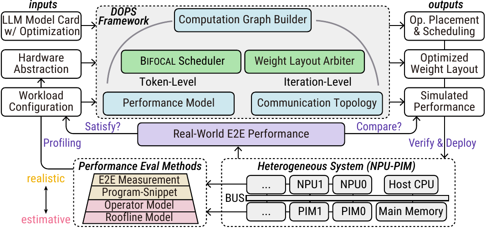

<div align="center">


# DOPS: Dynamic OPerator Sorting for Heterogeneous NPU–PIM LLM Inference

<p>
  <a href="./docs/framework.pdf">
    
  </a>
</p>


<p><em>📄 Click the framework figure above to open the PDF version in <code>./docs/framework.pdf</code>.</em></p>

DOPS is a simulation and analysis framework for studying decoder-only LLM inference on heterogeneous **NPU–PIM** platforms. It accompanies the paper **Beyond Prefill-Decode Disaggregation: Dissecting LLM Inference for Heterogeneous Platforms via Dynamic OPerator Scheduling** and provides a practical codebase for computation-graph construction, hardware abstraction, runtime modeling, scheduling, weight-layout search, trace export, and result analysis.

**Quick links:** [Demo video](https://vimeo.com/1178735972) · [Configuration Reference](./docs/CONFIG_REFERENCE.md)

</div>

---

## ✨ Overview

DOPS is built around a closed loop with three inputs:

1. an **LLM model card**,
2. a **hardware abstraction** of the target heterogeneous system, and
3. a **workload configuration** (batch size, prefill length, decode length, and scheduling/search settings).

From these inputs, DOPS:

- builds a stage-aware execution DAG for prefill and decode,

- instantiates **performance models** and **communication topology models**,

- searches for a dynamic operator-to-device mapping using the **Bifocal scheduler**,

- optionally searches for a blockwise persistent-weight layout using the **Weight Layout Arbiter**, and

- exports schedules, traces, and summary JSON files for downstream comparison and visualization.

  

---

## 🧰 Dependencies

> Recommended Python version: **3.10+**

### Minimal installation for the core CLI flow

The analytical fast-mode workflow uses only the Python standard library on
Python 3.12+. On Python 3.10 or 3.11, install the compatibility helper with
`python -m pip install typing_extensions`.

PyTorch is only needed by selected trace conversion, profiling, or optional
backend utilities; it is not required by the quick test below.

### Optional external runtimes and toolchains

These are only needed for specific backends or reproduction workflows.

- **Ramulator2 / trace-based PIM flow**  
  Needed when you want the trace-based PIM backend instead of the analytical fast path.

- **Huawei CANN / Ascend-C / msprof**  
  Needed for reproducing measured results.

- **LLMCompass**  
  Needed when `npu_backend=llmcompass`.

- **Plotting / analysis stack**  
  The full paper-reproduction workflow may additionally use a standard scientific Python stack such as `numpy`, `pandas`, `matplotlib`, `scipy`, `seaborn`, and graph/IO helpers, depending on the scripts you run.

---

## 🚀 Quick Start

Create a Python environment and run a small analytical PD/Bifocal comparison
directly from the repository root:

```bash
python3 -m venv .venv
source .venv/bin/activate
python3 src/main.py evaluate \
  --config src/examples/evaluate_test_config.json \
  --model_family qwen \
  --model_variant 1.8b \
  --batch 1 \
  --prefill_len 8 \
  --decode_len 4 \
  --decode_sample_stride 1 \
  --decode_plan_refresh_stride 1 \
  --result_dir ../../output/readme_smoke \
  --algo Bifocal \
  --baselines PD \
  --npu_backend fast \
  --pim_fast_mode
```

This test does not require a GPU, NPU, PIM device, external dataset, or model
weights. A successful run prints both `PD` and `Bifocal` in the comparison table
and writes their summaries plus operator and communication traces under
`output/readme_smoke/`.

### Longer bundled evaluation

The current repository is organized around a `src/` code tree and a `commands/` launcher tree. The fastest way to test the framework  is to stay at the project root and use the provided wrapper script, which already enables simulation based on roofline models (fast NPU and fast PIM in code).

### 1️⃣ Run the bundled fast-mode evaluation

```bash
bash commands/command_single_evaluate.sh
```

`commands/command_single_evaluate.sh` is a thin wrapper around:

```bash
python3 src/main.py evaluate \
  --config src/examples/evaluate_test_config.json \
  --npu_backend fast \
  --pim_fast_mode \
  --debug
```

The runtime for this execution is approximately 7 minutes.

If using the Ramulator backend for PIM, the first run will be slower, taking around 20 minutes. Subsequent runs will be significantly faster, as previously simulated traces are cached as `.pkl`files.

### 2️⃣ Inspect the outputs

With the bundled example config, outputs are written under:

```text
./output/evaluate_single_test/hardware_1npu_2aim_evaluate/
└── qwen_7b_fp16_b4_s2/
```

A successful run produces at least:

- `baseline_compare_<prefill>x<decode>.json`
- `algo_PD/best_summary_<prefill>x<decode>.json`
- `algo_Bifocal/best_summary_<prefill>x<decode>.json`
- `*_ops_trace.csv`
- `*_comms_trace.csv`

> 📘 For a field-by-field explanation of the hardware and evaluation JSON files, see the [Configuration Reference](./docs/CONFIG_REFERENCE.md).

---

## 🔄 Complete Workflow

The current CLI exposes two main modes:

- `evaluate`: run scheduling / baseline comparisons and export traces.
- `weight-suggest`: run the weight-layout arbiter on top of the scheduling flow.

In the current repository setup, the **default model is the roofline model**. This setup is suitable for `evaluate` experiments only. To reproduce the paper results and run `weight-suggest`-mode optimizations, you need to adjust the relevant parameters in the config.

### Step 1. Prepare a model shape card under `configs/`

Model shapes are resolved from the project-level `configs/` directory using `(model_family, model_variant)`.

The bundled Llama-7B shape card is:

```json
{
  "type": "llama_7b",
  "hidden_dim": 4096,
  "layer_num": 32,
  "intermediate_dim": 11008,
  "q_head_num": 32,
  "kv_head_num": 32
}
```

If your model is not already registered in `src/model_parser.py`, you can either add a new mapping there or pass a custom `shape_file` in the config JSON.

---

### Step 2. Prepare a hardware JSON

Hardware descriptions are typically placed under `src/examples/`, although any path is fine as long as the config points to it.

The hardware JSON can be wrapped as either `{"hardware": ...}` or `{"cluster": ...}`. The parser accepts two major topology styles:

- **`fc`**: a fully connected fabric. You can provide either one shared bandwidth (`fc_bw_GBs`) or explicit `links`.
- **`star`**: a host-centric fabric. Use explicit links that connect all accelerators through the host.

A minimal example looks like this:

```json
{
  "hardware": {
    "topology": "fc",
    "devices": [
      {
        "name": "CPU0",
        "type": "cpu",
        "tflops": 0.01,
        "mem_bw_GBs": 32768.0,
        "mem_capacity_GB": 8192.0,
        "cpu_read_latency_ns": 70.0,
        "cpu_write_latency_ns": 85.0,
        "cpu_cacheline_B": 64
      },
      {
        "name": "Ascend_910B_NPU0",
        "type": "npu",
        "tflops": 280.0,
        "mem_bw_GBs": 819.2,
        "mem_capacity_GB": 16.0,
        "llmcompass_device": "A100_80GB_fp16"
      },
      {
        "name": "PIM0",
        "type": "pim",
        "pim_type": "accel",
        "tflops": 16.0,
        "mem_bw_GBs": 16384.0,
        "mem_capacity_GB": 16.0,
        "pim_read_latency_ns": 5.0,
        "pim_write_latency_ns": 30.0,
        "freq_ghz": 0.8,
        "pim_memory": {
          "addr_map_unit": "bits",
          "addr_map": {
            "row": 14,
            "channel": 1,
            "bank": 2,
            "column": 8,
            "offset": 12
          }
        }
      }
    ],
    "fc_bw_GBs": 62.0,
    "link_defaults": {
      "latency_s": 0.0,
      "overhead_s": 0.0,
      "flit_size_B": 16,
      "max_payload_B": 256
    }
  }
}
```

> 📘 For the meaning of each key, see the [Configuration Reference](./docs/CONFIG_REFERENCE.md).

#### 💡 Practical guidance

- Use **one CPU host** to model shared memory or host-side routing even if you do not schedule much work on CPU.
- For every **PIM** device, make sure `mem_capacity_GB` matches the capacity implied by `pim_memory.addr_map`; the parser validates this and raises an error if they disagree.
- When using `npu_backend=llmcompass`, set `llmcompass_device` on each NPU. LLMCompass' bundled keys include `A100_80GB_fp16`, `TPUv3`, `MI210`, and `TPUv3_new`; the bundled Ascend-named examples use `A100_80GB_fp16` as an explicit proxy key.

---

### Step 3. Prepare `evaluate_config.json`

A representative fast-mode evaluation config looks like this:

```json
{
  "model_family": "llama",
  "model_variant": "7b",
  "dtype": "fp16",
  "batch": 4,
  "prefill_len": 128,
  "decode_len": 512,
  "decode_sample_stride": 2,
  "decode_plan_refresh_stride": 2,
  "pim_config_path": "./aim_simulator/PIM_AiM.json",
  "ramulator_config_path": "./aim_simulator/example.yaml",
  "result_dir": "./output/evaluate_single_test/hardware_1npu_2aim_evaluate_eta0p1/",
  "hardware_json": "./examples/hardware_1npu_2aim.json",
  "algo": ["Bifocal"],
  "baselines": ["PD"],
  "tp_qkv": 2,
  "tp_ffn": 2,
  "npu_backend": "fast",
  "pim_fast_mode": true,
  "scheduler_seed": 0,
  "dump_graph": false,
  "dump_graph_dir": "./output/evaluate_single_test/hardware_1npu_2aim/graph_dumps"
}
```

A few details are easy to miss:

- `algo` and `baselines` now use the **paper-aligned names** such as `Bifocal`, `HEFT`, `PD`, `AF`, `PD+Linear`, `PD+Attn`, and `PD+FFN`.
- `scheduler_seed` makes Bifocal's random tie-breaking reproducible; omit it only when intentionally exploring equivalent tie outcomes.
- Relative paths in the config are resolved relative to the config JSON first, then `src/`, then the current working directory.

> 📘 For the meaning of each key, see the [Configuration Reference](./docs/CONFIG_REFERENCE.md).

#### Optional: specify quantization and sparsity

`src/optimizations.py` reads optimization annotations from the run config. The shortest form is to add an `optimizations` block:

```json
{
  "optimizations": {
    "quantization": {
      "enable": true,
      "mode": "w4a16",
      "method": "awq",
      "weight_bits": 4,
      "activation_bits": 16,
      "activation_io": "fp16",
      "group_size": 128
    },
    "sparsity": {
      "weight": {
        "enable": true,
        "method": "magnitude",
        "pattern": "2:4",
        "storage": "compressed",
        "assume_sparse_compute": true
      }
    }
  }
}
```

A complete runnable example is provided at `src/examples/evaluate_quant_sparse_config.json`. Run it with:

```bash
CONFIG=./src/examples/evaluate_quant_sparse_config.json \
  bash commands/command_single_evaluate.sh
```

To run the same wrapper with LLMCompass instead of fast mode:

```bash
CONFIG=./src/examples/evaluate_quant_sparse_config.json \
NPU_BACKEND=llmcompass \
  bash commands/command_single_evaluate.sh
```

---

### Step 4. Run `evaluate`

From the project root, you can use either the wrapper script or the Python CLI directly.

**Wrapper script:**

```bash
bash commands/command_single_evaluate.sh
```

**Direct CLI:**

```bash
python3 src/main.py evaluate \
  --config src/examples/evaluate_test_config.json \
  --npu_backend fast \
  --pim_fast_mode \
  --debug
```

This flow:

1. loads the model shape card from `configs/`,
2. validates tensor-parallel settings,
3. builds the execution DAG for prefill and decode,
4. loads the hardware JSON and instantiates devices / links,
5. builds the cost model for the selected NPU backend and PIM mode,
6. runs the requested scheduler(s) and baseline(s), and
7. exports summaries plus raw op / communication traces.

#### 📂 Typical output layout

A representative output tree from the bundled fast-mode example is:

```text
src/examples/output/evaluate_single_test/hardware_1npu_2aim_evaluate_eta0p1/
└── llama_7b_fp16_b1_s1/
    ├── baseline_compare_<prefill>x<decode>.json
    ├── driver_debug.txt
    ├── algo_PD/
    │   ├── best_summary_<prefill>x<decode>.json
    │   ├── PD_linear_prefill-<prefill>xdecode_<decode>_ops_trace.csv
    │   ├── PD_linear_prefill-<prefill>xdecode_<decode>_comms_trace.csv
    │   └── pim_sim_<prefill>x<decode>.txt
    ├── algo_xx/
    │   ├── ...
    ├── algo_xx/
    │   ├── xxx
    │   ├── ...
    └── algo_Bifocal/
        ├── best_summary_<prefill>x<decode>.json
        ├── Bifocal_linear_prefill-<prefill>xdecode_<decode>_ops_trace.csv
        ├── Bifocal_linear_prefill-<prefill>xdecode_<decode>_comms_trace.csv
        └── pim_sim_<prefill>x<decode>.txt
```

The run directory itself is named automatically as:

```text
<result_root>/<family>_<variant>_<dtype>_b<batch>[_s<refresh_stride>]/
```

#### 🔍 How to read the results

- **`baseline_compare_*.json`** is the top-level comparison file. It is the easiest artifact for scripts that only need `prefill_time_s`, `decode_time_s`, and `total_time_s`.
- **`algo_<policy>/best_summary_*.json`** stores the richer schedule export for one policy, including serialized schedules and trace pointers.
- **`*_ops_trace.csv`** stores raw operator execution events with device assignment and timing.
- **`*_comms_trace.csv`** stores raw communication events between devices.
- **`pim_sim_*.txt`** stores the PIM-side runtime log for that run.

#### ✅ What you can do with `evaluate`

`evaluate` is the right mode for:

- comparing `Bifocal` or `HEFT` against baselines such as `PD`, `AF`, `PD+Linear`, `PD+Attn`,and  `PD+FFN`,
- running hardware-scaling studies by swapping `hardware_json`,
- generating raw traces for downstream visualization, and
- studying the effect of batch size, prefill length, decode length, and TP settings.

#### 💡 **Practical guidance**

If the `evaluate` results are not satisfactory, you can try tuning the Bifocal hyperparameters defined in the config. Common knobs include:

```python
SCHED_JOINT_LK_ENABLE: bool = True
SCHED_JOINT_LK_H: int = 3
SCHED_JOINT_LK_GAMMA: float = 0.4
SCHED_JOINT_LK_CONSIST_LAMBDA: float = 3
SCHED_JOINT_LK_PLAN_HINT_MAX: int = 3

SCHED_WEIGHT_BIAS_ETA: float = 0.0

# AMORT
SCHED_DECODE_AMORT_ENABLE = True
SCHED_DECODE_AMORT_ALPHA = 1
SCHED_DECODE_AMORT_RMIN = 1
SCHED_DECODE_AMORT_REUSE_PROB = 1.0
```

You can sweep these parameters with `commands/sweep_bifocal_all_params.py`.

**Wrapper script:**

```bash
bash commands/run_hpc_sweep_bifocal_all.sh
```

**Direct CLI:**

```bash
python3 commands/sweep_bifocal_all_params.py \
  --mode grid \
  --config-py ./config.py \
  --h 2 3 4 \
  --gamma 0 0.2 0.4 \
  --lambda 0 3 5 \
  --plan_hint_max 3 \
  --eta 0.0 0.1 1 \
  --amort_enable true \
  --objective total \
  --outdir ./output/sweep_bifocal_all \
  --amort-enable true \
  --amort-alpha 1 \
  --amort-rmin 1.0 \
  --amort-reuse-prob 0.5 1.0 \
  --resume \
  --config ./src/examples/evaluate_test_config.json
```

---

### Step 5. Run `weight-suggest` (optional)

Use this mode when you want to search for a blockwise persistent-weight layout on top of the scheduling flow. Before doing so, you must manually measure the format-conversion overhead. The format-conversion overhead used in the paper is stored under `./src/runtime_models/`.

**Wrapper script:**

```bash
bash commands/command_single_weight.sh
```

**Direct CLI:**

```bash
python src/main.py weight-suggest \
  --config src/examples/weight_suggest_test_config.json \
  --npu_backend lut \
  --debug
```

Typical artifacts are:

```text
<result_dir>/
├── all_passes_<tag>.json
├── best_summary_<tag>.json
├── weight_storage_suggestion_<tag>.json
├── weight_storage_suggestion_<tag>_full.json
├── weight_storage_suggestion_<tag>_compare.json
├── weight_suggest_al_debug.txt
└── pim_sim_<tag>.txt
```

Use `weight-suggest` when you want to compare a fixed global layout against a searched blockwise layout under the same workload and hardware setting.

---

## 🗂️ Repository Layout

```text
.
├── CITATION.cff                         # Software and associated-paper citation metadata.
├── src/                                 # Main implementation of DOPS
│   ├── main.py                          # CLI entry point. Supports `evaluate` and `weight-suggest`.
│   ├── mainlib/                         # High-level workflow logic for CLI parsing, evaluation, simulation, and storage helpers.
│   ├── scheduler/                       # Scheduler package.
│   │   ├── scheduler_base.py            # Shared timing / placement machinery used by all schedulers.
│   │   ├── scheduler_bifocal.py         # Bifocal scheduler.
│   │   ├── scheduler_heft.py            # HEFT scheduler.
│   │   ├── scheduler_naive.py           # Simple topology/order baseline scheduler.
│   │   ├── scheduler_common.py          # Shared scheduling helpers.
│   │   ├── scheduler_comm.py            # Communication-related scheduling helpers.
│   │   └── scheduler_types.py           # Shared scheduler-side type definitions.
│   ├── cost_model.py                    # Unified cost-model entry point.
│   ├── costmodel_impl/                  # Backend-specific and mixin-based cost-model implementation.
│   │   ├── cost_model_npu_ascend_backend.py
│   │   ├── cost_model_npu_llmcompass_backend.py
│   │   ├── cost_model_pim_backend.py
│   │   ├── compute_mixin.py
│   │   ├── estimate_mixin.py
│   │   ├── runtime_mixin.py
│   │   ├── npu_backends.py
│   │   ├── pim_backends.py
│   │   └── shared.py
│   ├── model_parser.py                  # Loads shape cards, validates TP settings, and builds the execution DAG.
│   ├── model_definition.py              # Decoder-only graph construction logic.
│   ├── task_graph.py                    # Core graph data structures.
│   ├── hardware.py                      # Hardware / topology parser and validator.
│   ├── buffer_manager.py                # Global memory manager and cache abstractions.
│   ├── comm_primitives.py               # Collective communication primitives and transfer helpers.
│   ├── plan_label.py                    # Metadata carrier for KV placement and trace artifacts.
│   ├── optimizations.py                 # Optional graph annotations such as quantization and sparsity.
│   ├── stats_recorder.py                # Writes raw op / communication traces.
│   ├── runtime_models/                  # Packaged analytical runtime tables.
│   ├── examples/                        # Example configs and hardware descriptions.
│   ├── aim_simulator/                   # Example AiM / Ramulator config files for trace-based PIM mode.
│   ├── pkl/                             # Cached latency/model artifacts.
│   ├── run_bifocal.py                   # Python entry script for Bifocal sweeps / studies.
│   ├── sweep_bifocal.py                 # Python sweep helper still used by the HPC launcher.
│   └── sweep_weight_suggest_params.py   # Weight-layout sweep helper.
├── commands/                            # Shell launchers and command-oriented sweep drivers.
│   ├── command_single_evaluate.sh
│   ├── command_single_weight.sh
│   ├── run_hpc_sweep_npu_aim_evaluate.slurm
│   ├── sweep_models_npu.sh
│   ├── sweep_models_npu_aim_evaluate.sh
│   ├── sweep_models_scale_down_evaluate.sh
│   └── sweep_bifocal_all_params.py
├── configs/                             # Model shape cards resolved by `src/model_parser.py`.
├── experiment/                          # Paper-figure scripts and interactive schedule visualization.
├── measurements/                        # Microbenchmarks, profiling utilities, LUT-generation scripts.
└── submodules/                          # Optional LLMCompass and CENT source snapshots.
```

---

## 🛠️ How to Extend the Framework

### Add a new model

1. Add a shape JSON under `configs/`.
2. Register it in `src/model_parser.py` (`FILE_MAP`).
3. Extend `src/model_definition.py` if the graph structure differs from existing decoder families.
4. If the model has MoE-specific behavior, also check the `tp_moe` path and any expert-routing assumptions.

### Add a new hardware target

1. Create a new hardware JSON under `src/examples/`.
2. Make sure device names, capacities, and topology are consistent with the backend you want to use.
3. For PIM devices, make sure `pim_memory.addr_map` matches `mem_capacity_GB`.
4. Pass the file through `--hardware_json` or set it in the config JSON.

### Add a new scheduler or baseline

- **New scheduler**: implement it under `src/scheduler/`, export it through `src/scheduler/__init__.py`, and wire it into the scheduler factory in `src/mainlib/`.
- **New baseline**: register it in `src/mainlib/baselines.py` with the `@register_baseline(...)` decorator.

### Add a new NPU or PIM backend

- Extend the backend logic in `src/cost_model.py`.
- Add a new NPU backend under `src/costmodel_impl/` or a new PIM path in `src/costmodel_impl/cost_model_pim_backend.py`.
- Place supporting tables under `src/runtime_models/` when needed.

### Add a new optimization annotation

If you want to model a new graph-side optimization such as another quantization or sparsity scheme, the main entry point is:

- `src/optimizations.py`

This file already contains the parsing and graph-annotation flow for quantization, weight sparsity, activation sparsity, and attention sparsity.

---

## 📊 Visualization

### `experiment/experiment_fig/`

These scripts generate the paper figures. Their headers are intended to document runnable examples and plotting assumptions.

### Experiment 1: Scheduling benefits & Speedup Analysis

- `plot_exp1_simulated.py`  
  Simulated latency and speedup comparison across policies.
- `plot_exp1_batch.py`  
  Batch-sensitivity analysis.
- `plot_exp1_utilization_violin.py`  
  Distribution-style utilization and co-utilization plots.
- `plot_exp1_gantt.py`  
  Case-study Gantt/timeline figure.

### Experiment 2: Hardware scaling & Marginal Return

- `plot_exp2_heatmap.py`  
  Speedup heatmaps across prefill/decode/model/hardware axes.
- `plot_exp2_baseline_marginal.py`  
  Marginal-return curves as more PIM budget is added.

### Experiment 3: Effectiveness of Weight Layout Arbiter

- `plot_exp3_layout_compare.py`  
  Compares conventional/global layouts against arbiter-optimized results.
- `plot_exp3_iter_from_txt_json.py`  
  Rebuilds arbiter iteration traces from JSON/log output.
- `plot_exp3_layout_compare_cfg_example.json`  
  Example plotting config.

### `experiment/demo/`

#### Browser timeline demo

Open the HTML demo directly in a browser:

```text
experiment/demo/index.html
```

#### Trace examples

We store reviewer-facing demo cases under [`experiment/demo/examples/`](./experiment/demo/examples/README.md). Each case can use its own subdirectory containing a baseline operator trace and a heuristic/Bifocal operator trace, for example:

```text
experiment/demo/examples/qwen7b_fp16_b16_p512_d512/
├── PD_linear_prefill-512xdecode_512_ops_trace.csv
└── Bifocal_linear_prefill-512xdecode_512_ops_trace.csv
└── ...
```
**Demo assets**

- [Demo trace examples guide](./experiment/demo/examples/README.md)

## 📄 License

DOPS-authored code is released under the [MIT License](./LICENSE).

## 📝 Citation

If you use DOPS, please cite the associated MICRO 2026 paper using the metadata
in [CITATION.cff](./CITATION.cff).


## 📖 Supplementary Materials and Simulation Time

The hyperparameter checklist for Sections 6.2–6.4 is provided in [`./docs/EXPERIMENT_HYPERPARAMETERS.md`](./docs/EXPERIMENT_HYPERPARAMETERS.md).

Some figures from Sections 6.2 and 6.4 of the paper are now provided under `./figs/paper_supplementary/`.

The runtime is primarily affected by the choice of backend, stride size, decode length, `tp_qkv`, and `tp_ffn`. The fastest performance is achieved when the backend is set to `fast mode`. When using Ramulator as the backend, simulation results are cached as `.pkl` files; the first simulation run is significantly slower, but subsequent runs are much faster.

For generating the results in `./figs/paper_supplementary/sec_6_2`, the simulation time for a single case ranges from 1 minutes to 10 minutes. We used `2 × Intel Xeon Platinum 8358` CPU, and the script `./commands/sweep_models_npu_aim_evaluate.sh` can execute 64 cases in parallel.

For generating the results in `./figs/paper_supplementary/sec_6_4`, the script `./commands/run_hpc_sweep_weight_suggest.sh` can execute 75 cases in parallel, with a total simulation time under 2 hours.

The number of parallel cases can be adjusted based on the available CPU memory capacity.
